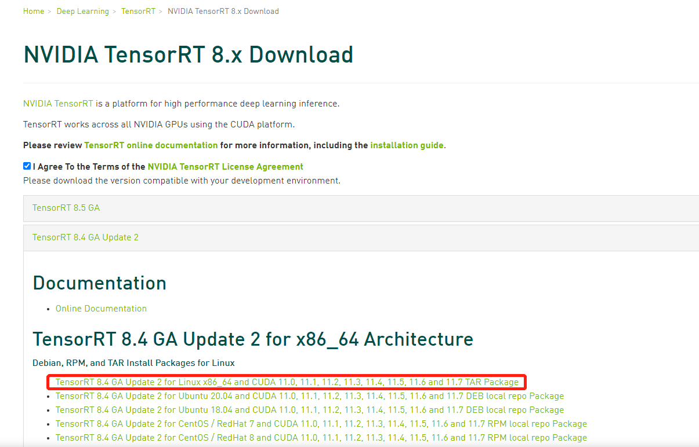
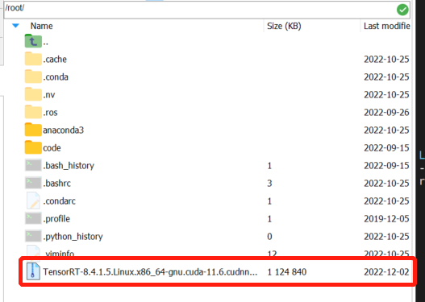
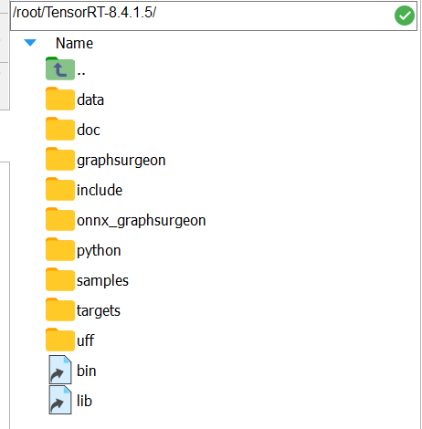

## 1.  Environment Configuration (x86)
- Use configured docker
    ```
    xxxx
    ```
    - if can't visualization, using the following command line:
        ```
        sudo docker stop xian_aqc
        sudo docker rm xian_aqc
        xhost +local:root
        xxxx
        ```
- If do not have configured docker, docker preparation as follow
    - Pull nvidia-docker
        ```
        $ sudo docker pull nvidia/cuda:11.4.3-cudnn8-devel-ubuntu20.04
        ```

    - Start docker (docker visualization)
        - xhost +local:root # 出现non-network local connections being added to access control list说明执行成功
        - run docker image
            ```
            sudo docker run --name xian_aqc -itd --volume="/tmp/.X11-unix:/tmp/.X11-unix:rw" -v /home/ntueee/yangjianbing:/root/code -p 2810:22 -p 6000:6000 -p 2812:2812 -e NVIDIA_DRIVER_CAPABILITIES=compute,utility --env="DISPLAY" --env="QT_X11_NO_MITSHM=1" --gpus all --shm-size="12g" --restart=always nvidia/cuda:11.4.3-cudnn8-devel-ubuntu20.04

            # 2810: ssh port
            # 6000: image wireless transmission port
            # 2812: PLC communication port
            ```
        - 注意：
            - 必须在host主机上先运行xhost +local:root
            - 必须在host主机上启动该镜像
            - 必须用sudo docker exec -it xxxx /bin/bash进入镜像

    - Login docker
        ```
        sudo docker exec -it xian_aqc /bin/bash
        ```
    - IP
        - PLC: 10.128.137.21
        - Orin sender： LAN1网口（eth0，AP）: 10.28.137.11；LAN2网口（eth1，PLC）: 10.128.137.22
        - Orin reciever (LAN1网口): 10.28.137.12
    - python3 link  
        ```
        rm -rf /usr/bin/python  
        ln -s /usr/bin/python3 /usr/bin/python
        ```

    - Install dependence
        - apt update && apt install -y libsm6 libxext6
        - apt-get install -y libxrender-dev
        - apt-get install libglib2.0-0
        - apt install libgl1-mesa-glx
        - pip install -r requirements.txt
    - 测试可视化是否成功  
        ```
        import cv2
        img = cv2.imread("figures/gazebo_show.png")
        cv2.imshow("show", img)
        cv2.waitKey(3000)
        ```

    - Install ssh (Note that enter container first!)
        - `$ apt-get update`
        - `$ apt-get install vim`
        - `$ apt-get install openssh-server`
        - 设置root密码，后续登录会用到: `$ passwd` # password: eee
        - 修改配置文件: `$ vim /etc/ssh/sshd_config`
            ``` 
            #PermitRootLogin prohibit-password
            PermitRootLogin yes
            UsePAM yes 修改为 no
            注释这一行PermitRootLogin prohibit-password
            添加一行PermitRootLogin yes
            UsePAM yes 修改为 no #禁用PAM
            ```
        - 重启ssh服务: `$ service ssh restart`
        - 添加开机启动
            - 新建`power_launch.sh`文件，放到根目录：`/root`下，`power_launch.sh`添加如下内容
                ```
                #!/bin/sh -e
                service ssh start &
                ```
            - 获取读写权限：`chmod 777 /root/power_launch.sh`
            - 编辑`~/.bashrc`: `vim ~/.bashrc`，在下面添加
                ```
                if [ -f /root/power_launch.sh ]; then
                        ./root/power_launch.sh
                fi
                ```

    - [ROS Installation](https://wiki.ros.org/noetic/Installation/Ubuntu)

    - TensorRT Installation
        - 下载[Tensorrt](https://developer.nvidia.com/nvidia-tensorrt-8x-download)，如下图所示：

            
        - [安装Tensorrt](https://docs.nvidia.com/deeplearning/tensorrt/install-guide/index.html#installing-tar)
        - 将下载好的Tenosrrt的.tar.gz压缩包先解压再拷贝到镜像中的/root目录下，如下图所示：

            
        - 解压Tenosrrt的.tar.gz压缩包
            ```
            $ tar -xzvf TensorRT-8.4.1.5.Linux.x86_64-gnu.cuda-11.6.cudnn8.4.tar.gz
            ```
        - 解压后的Tensorrt文件构成如下图所示：

            

        - 添加环境变量：在~/.bashrc中加入如下代码：
            ```
            $ export LD_LIBRARY_PATH=$LD_LIBRARY_PATH:/root/TensorRT-8.4.1.5/targets/x86_64-linux-gnu/lib
            ```
        - 安装Python TensorRT wheel（选择对应的python版本），指令如下：
            ```
            $ cd /root/TensorRT-8.4.1.5/python
            $ python -m pip install tensorrt-8.4.1.5-cp37-none-linux_x86_64.whl #如果出现 Certificate verification failed报错，可以用下面指令替换
            $ python -m pip --trusted-host pypi.python.org --trusted-host pypi.tuna.tsinghua.edu.cn install tensorrt-8.4.1.5-cp37-none-linux_x86_64.whl -i https://pypi.tuna.tsinghua.edu.cn/simple/
            ```
        - 安装UFF wheel，指令如下：
            ```
            $ cd .. 
            $ cd uff
            $ python -m pip --trusted-host pypi.python.org --trusted-host pypi.tuna.tsinghua.edu.cn install uff-0.6.9-py2.py3-none-any.whl -i https://pypi.tuna.tsinghua.edu.cn/simple/
            ```
        - 安装graphsurgeon wheel，指令如下：
            ```
            $ cd .. 
            $ cd graphsurgeon
            $ python -m pip --trusted-host pypi.python.org --trusted-host pypi.tuna.tsinghua.edu.cn install graphsurgeon-0.4.6-py2.py3-none-any.whl -i https://pypi.tuna.tsinghua.edu.cn/simple/
            ```
        - 安装onnx-graphsurgeon wheel，指令如下：
            ```
            $ cd .. 
            $ cd onnx_graphsurgeon
            $ python -m pip --trusted-host pypi.python.org --trusted-host pypi.tuna.tsinghua.edu.cn install onnx_graphsurgeon-0.3.12-py2.py3-none-any.whl -i https://pypi.tuna.tsinghua.edu.cn/simple/
            ```

        - 安装cuda-python(注意：python>=3.7)，指令如下：
            ```
            $ pip --trusted-host pypi.python.org --trusted-host pypi.tuna.tsinghua.edu.cn install cuda-python -i https://pypi.tuna.tsinghua.edu.cn/simple/
            ```
        - 安装pycuda
            ```
            $ pip --trusted-host pypi.python.org --trusted-host pypi.tuna.tsinghua.edu.cn install pycuda -i https://pypi.tuna.tsinghua.edu.cn/simple/

            若报src/cpp/cuda.hpp:14:10: fatal error: cuda.h: No such file or directory错误，解决方法：在~/.bashrc中添加export PATH=/usr/local/cuda-11.6/bin:$PATH。添加完成后，记得source ~/.bashrc
            ```
        - 安装opencv-python， 指令如下：
            ```
            $ pip --trusted-host pypi.python.org --trusted-host pypi.tuna.tsinghua.edu.cn install opencv-python -i https://pypi.tuna.tsinghua.edu.cn/simple/
            ``` 

        - 运行trt部署代码若出现如下错误：
            
            - 解决：找到`/usr/local/lib/python3.8/dist-packages/tensorrt/__init__.py`,将line 166的`bool: np.bool`修改为`bool: bool`


    - rosbridge_suite
        ```
        apt-get update
        apt-get install ros-noetic-rosbridge-suite
        ```

    - cv_control lib

    - Related Lib

## 2. RUN
- 获取读写权限
    ```
    chmod 777 src/xian_ai_pkg/src/xian_cell_guide_recognition.py
    chmod 777 src/xian_ai_pkg/src/xian_keypoints_recognition.py
    ```
- compile 
    ```
    $ cd /xxxx/xian_aqc_ws
    $ catkin_make
    若编译出现问题，删掉xxxx/xian_aqc_ws/src/CMakeLists.txt，然后再编译试试。
    ```
- vim ~/.bashrc (source ~/.bashrc)
    ```
    加入如下代码
    source /root/code/xian_aqc_ws/devel/setup.bash
    ```
## 3. Output

| Output Topic | Message Type |
|:--- |:---  |
| aqc_cell_detection_resuls | xian_msg_pkg/xian_cell_guide_msg |

## 4. [Node description](./xian_project_file/doc/node_description.MD)


## 5. TCP variable list 
- For client: note that **write** first, then **read**.
- For server: note that **read** first, then **write**.
    ```
    struct RetractableBoxToServer
    {
        int tcp_retrable_box_heart_beat = 0;    // tcp client heart beat
        int retractable_motion_flag = 0;        // 0: stop 1: in processing
        int retractable_box_status = 0;         // 0: extent, 1: retract
        int error_code = 9000;                  // 9001: approximated switch error
    };
    ```

    ```
    struct ServerToRetractableBox
    {
        int tcp_server_heart_beat;       // heart beat
        int auto_manual_switch_flag;     // 0: auto; 1:manual
    };
    ```


