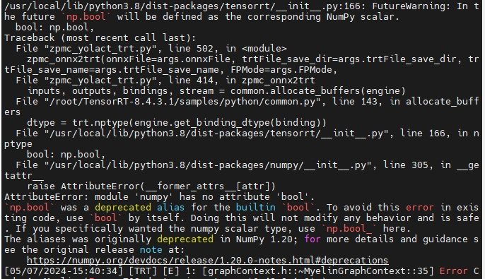

## 1.  Environment Configuration (x86)
- Use configured docker
    ```
    xxxx
    ```
    - if can't visualization, using the following command line:
        ```
        sudo docker stop xian_aqc
        sudo docker rm xian_aqc
        xhost +local:root
        xxxx
        ```
- If do not have configured docker, docker preparation as follow
    - Pull nvidia-docker
        ```
        $ sudo docker pull nvcr.io/nvidia/l4t-jetpack:r35.4.1
        ```

    - Start docker (`reciever side`, docker visualization)
        - xhost +local:root # 出现non-network local connections being added to access control list说明执行成功
        - run docker image
            ```
            sudo docker run --name xian_aqc -itd --log-opt max-size=50m --runtime nvidia --volume="/tmp/.X11-unix:/tmp/.X11-unix:rw" -v /home/nvidia/yangjianbing/:/root/code --net host -e NVIDIA_DRIVER_CAPABILITIES=compute,utility --env="DISPLAY" --env="QT_X11_NO_MITSHM=1" --shm-size="12g" --restart=always nvcr.io/nvidia/l4t-jetpack:r35.4.1
            ```
        - 注意：
            - 必须在host主机上先运行xhost +local:root
            - 必须在host主机上启动该镜像
            - 必须用sudo docker exec -it xian_aqc /bin/bash进入镜像
    
    - Start docker (`sender side`, docker visualization)
        - xhost +local:root # 出现non-network local connections being added to access control list说明执行成功
        - run docker image 
            ```
            sudo docker run --name xian_aqc -itd --log-opt max-size=50m --runtime nvidia --device /dev/video0 --device /dev/video1 --device /dev/video2 --device /dev/video3 --volume="/tmp/.X11-unix:/tmp/.X11-unix:rw" -v /media/nvidia/nvme0n1pnvme0n1p1/home/nvidia/yangjianbing:/root/code -p 2810:22 -p 2812:2812 -p 2840:2840 -e NVIDIA_DRIVER_CAPABILITIES=compute,utility --env="DISPLAY" --env="QT_X11_NO_MITSHM=1" --shm-size="12g" --restart=always nvcr.io/nvidia-l4t-jetpack-r35.4.1:v1.4

            # 2810: ssh port
            # 8000-8030: image wireless transmission port
            # 2812: PLC communication port
            # 2840:2840: TCP retractable box port
            ```
        - 注意：
            - 必须在host主机上先运行xhost +local:root
            - 必须在host主机上启动该镜像
            - 必须用sudo docker exec -it xian_aqc /bin/bash进入镜像

    - Login docker
        ```
        sudo docker exec -it xian_aqc /bin/bash
        ```
    - IP
        - PLC: 10.128.137.21
        - Orin sender：（LAN1网口eth0，AP）: 10.28.137.11；LAN2网口（eth1，PLC）: 10.128.137.22
        - Orin reciever: (LAN1网口,eth0，AP): 10.28.137.12
    - python3 link  
        ```
        rm -rf /usr/bin/python  
        ln -s /usr/bin/python3 /usr/bin/python
        ```

    - Install dependence
        - apt update && apt install -y libsm6 libxext6
        - apt-get install -y libxrender-dev
        - apt-get install libglib2.0-0
        - apt install libgl1-mesa-glx
        - apt install -y build-essential cmake-qt-gui python3-dev python3-numpy python3-flake8 flake8 gstreamer1.0-plugins-base gstreamer1.0-plugins-good gstreamer1.0-plugins-ugly libgstreamer-plugins-base1.0-dev libgstreamer-plugins-good1.0-dev qt5-default libavresample-dev libavfilter-dev libavformat-dev libavutil-dev libavcodec-dev libhdf5-dev libtesseract-dev libeigen3-dev libtbb-dev libgoogle-glog-dev libgflags-dev liblapacke-dev liblapack-dev libatlas-base-dev 
        - pip install -r requirements.txt
    - Compile opencv in Jetson
        - Download OpenCV main and contrib repos
            - opencv源码：`https://github.com/opencv/opencv.git`，选择自己需要的版本
            - opencv contrib源码: `https://github.com/opencv/opencv_contrib.git`, 该模块将 CUDA 功能与 OpenCV 一起使用。（注意：`选择跟上面对于的opencv版本`）
        - Compile
            - `cd opencv`(下载的opencv源码)
            - `mkdir build && cd build`
            - cmake
                ```
                cmake -DCMAKE_INSTALL_PREFIX="/root/opencv_cuda_4.7.0/" -DPYTHON_DEFAULT_EXECUTABLE="/usr/bin/python3" -DENABLE_FAST_MATH=YES -DWITH_CUDA=YES -DOPENCV_GENERATE_PKGCONFIG=YES -DWITH_TBB=YES -DCUDA_FAST_MATH=YES -DOPENCV_ENABLE_NONFREE=YES -DWITH_QT=YES -DCMAKE_CONFIGURATION_TYPES="Release" -DWITH_OPENGL=YES -DENABLE_FLAKE8=YES -DOPENCV_DNN_CUDA=YES -DOPENCV_EXTRA_MODULES_PATH="/root/code/opencv_contrib-4.7.0/modules/" -DCUDA_ARCH_BIN=${cuda_compute} ..


                - 参数解释：
                    -DCMAKE_INSTALL_PREFIX 当执行make
                install时，opencv的安装路径
                    -DOPENCV_EXTRA_MODULES_PATH 设置成opencv contrib下modules路径
                - 你应该有一个类似于以下的输出，这表明预构建是成功的
                
                    -- The CXX compiler identification is GNU 9.4.0
                    ...
                    -- Performing Test...
                    ...
                    -- General configuration for OpenCV 4.5.5-dev ======================
                    ...
                    --   NVIDIA CUDA:                   YES (ver 11.6, CUFFT CUBLAS)
                    --     NVIDIA GPU arch:             61
                    --     NVIDIA PTX archs:
                    -- 
                    --   cuDNN:                         YES (ver 8.3.2)
                    ...
                    -- Configuring done
                    -- Generating done
                    -- Build files have been written to: /home/j/opencv/build

                ```
        - `make -j 8` # (lscpu)
        - `make install`
    
    - 添加编译好的opencv路径
        - c++ (CMakeLists.txt)
            ```
            set(OpenCV_DIR "/root/opencv_cuda_4.7.0/lib/cmake/opencv4/") # 在find_package(OpenCV REQUIRED)上面添加这句话，路径为make install安装目录下的 lib/cmake/opencv4/
            find_package(OpenCV REQUIRED)
            ```
        - python
            - vim ~/.bashrc
                ```
                export PYTHONPATH=$PYTHONPATH:/root/opencv_cuda_4.7.0/lib/python3.8/site-packages
                # make install安装目录下的lib/python3.x/site-packages
                # 不加这一句会出现Error in processing images: OpenCV(4.10.0) /io/opencv/modules/core/include/opencv2/core/private.cuda.hpp:106: error: (-216:No CUDA support) The library is compiled without CUDA support in function 'throw_no_cuda'错误
                ```
                
            - source ~/.bashrc
            - 若出现`ImportError: /lib/aarch64-linux-gnu/libgomp.so.1: cannot allocate memory in static TLS block`，则继续在`~/.bashrc`添加`export LD_PRELOAD=/usr/lib/aarch64-linux-gnu/libgomp.so.1`，最后`source ~/.bashrc`


    - 测试可视化是否成功  
        ```
        import cv2
        img = cv2.imread("figures/gazebo_show.png")
        cv2.imshow("show", img)
        cv2.waitKey(3000)
        ```

    - Install ssh (Note that enter container first!)
        - `$ apt-get update`
        - `$ apt-get install vim`
        - `$ apt-get install openssh-server`
        - 设置root密码，后续登录会用到: `$ passwd` # password: eee
        - 修改配置文件: `$ vim /etc/ssh/sshd_config`
            ``` 
            #PermitRootLogin prohibit-password
            PermitRootLogin yes
            UsePAM yes 修改为 no
            注释这一行PermitRootLogin prohibit-password
            添加一行PermitRootLogin yes
            UsePAM yes 修改为 no #禁用PAM
            ```
        - 重启ssh服务: `$ service ssh restart`
        - 添加开机启动
            - 新建`power_launch.sh`文件，放到根目录：`/root`下，`power_launch.sh`添加如下内容
                ```
                #!/bin/sh -e
                service ssh start &
                ```
            - 获取读写权限：`chmod 777 /root/power_launch.sh`
            - 编辑`~/.bashrc`: `vim ~/.bashrc`，在下面添加
                ```
                if [ -f /root/power_launch.sh ]; then
                        ./root/power_launch.sh
                fi
                ```

    - [ROS Installation](https://wiki.ros.org/noetic/Installation/Ubuntu)
    - ```$ vim /opt/ros/noetic/share/cv_bridge/cmake/cv_bridgeConfig.cmake```,替换成如下内容（你指定的opencv版本）：
        ```
        set(libraries "cv_bridge;~/opencv_cuda_4.7.0/lib/libopencv_alphamat.so.4.7.0;~/opencv_cuda_4.7.0/lib/libopencv_aruco.so.4.7.0;~/opencv_cuda_4.7.0/lib/libopencv_barcode.so.4.7.0;~/opencv_cuda_4.7.0/lib/libopencv_bgsegm.so.4.7.0;~/opencv_cuda_4.7.0/lib/libopencv_bioinspired.so.4.7.0;~/opencv_cuda_4.7.0/lib/libopencv_calib3d.so.4.7.0;~/opencv_cuda_4.7.0/lib/libopencv_ccalib.so.4.7.0;~/opencv_cuda_4.7.0/lib/libopencv_core.so.4.7.0;~/opencv_cuda_4.7.0/lib/libopencv_cudaarithm.so.4.7.0;~/opencv_cuda_4.7.0/lib/libopencv_cudabgsegm.so.4.7.0;~/opencv_cuda_4.7.0/lib/libopencv_cudacodec.so.4.7.0;~/opencv_cuda_4.7.0/lib/libopencv_cudafeatures2d.so.4.7.0;~/opencv_cuda_4.7.0/lib/libopencv_cudafilters.so.4.7.0;~/opencv_cuda_4.7.0/lib/libopencv_cudaimgproc.so.4.7.0;~/opencv_cuda_4.7.0/lib/libopencv_cudalegacy.so.4.7.0;~/opencv_cuda_4.7.0/lib/libopencv_cudaobjdetect.so.4.7.0;~/opencv_cuda_4.7.0/lib/libopencv_cudaoptflow.so.4.7.0;~/opencv_cuda_4.7.0/lib/libopencv_cudastereo.so.4.7.0;~/opencv_cuda_4.7.0/lib/libopencv_cudawarping.so.4.7.0;~/opencv_cuda_4.7.0/lib/libopencv_cudev.so.4.7.0;~/opencv_cuda_4.7.0/lib/libopencv_cvv.so.4.7.0;~/opencv_cuda_4.7.0/lib/libopencv_datasets.so.4.7.0;~/opencv_cuda_4.7.0/lib/libopencv_dnn.so.4.7.0;~/opencv_cuda_4.7.0/lib/libopencv_dnn_objdetect.so.4.7.0;~/opencv_cuda_4.7.0/lib/libopencv_dnn_superres.so.4.7.0;~/opencv_cuda_4.7.0/lib/libopencv_dpm.so.4.7.0;~/opencv_cuda_4.7.0/lib/libopencv_face.so.4.7.0;~/opencv_cuda_4.7.0/lib/libopencv_features2d.so.4.7.0;~/opencv_cuda_4.7.0/lib/libopencv_flann.so.4.7.0;~/opencv_cuda_4.7.0/lib/libopencv_freetype.so.4.7.0;~/opencv_cuda_4.7.0/lib/libopencv_fuzzy.so.4.7.0;~/opencv_cuda_4.7.0/lib/libopencv_gapi.so.4.7.0;~/opencv_cuda_4.7.0/lib/libopencv_hdf.so.4.7.0;~/opencv_cuda_4.7.0/lib/libopencv_hfs.so.4.7.0;~/opencv_cuda_4.7.0/lib/libopencv_highgui.so.4.7.0;~/opencv_cuda_4.7.0/lib/libopencv_img_hash.so.4.7.0;~/opencv_cuda_4.7.0/lib/libopencv_imgcodecs.so.4.7.0;~/opencv_cuda_4.7.0/lib/libopencv_imgproc.so.4.7.0;~/opencv_cuda_4.7.0/lib/libopencv_intensity_transform.so.4.7.0;~/opencv_cuda_4.7.0/lib/libopencv_line_descriptor.so.4.7.0;~/opencv_cuda_4.7.0/lib/libopencv_mcc.so.4.7.0;~/opencv_cuda_4.7.0/lib/libopencv_ml.so.4.7.0;~/opencv_cuda_4.7.0/lib/libopencv_objdetect.so.4.7.0;~/opencv_cuda_4.7.0/lib/libopencv_optflow.so.4.7.0;~/opencv_cuda_4.7.0/lib/libopencv_phase_unwrapping.so.4.7.0;~/opencv_cuda_4.7.0/lib/libopencv_photo.so.4.7.0;~/opencv_cuda_4.7.0/lib/libopencv_plot.so.4.7.0;~/opencv_cuda_4.7.0/lib/libopencv_quality.so.4.7.0;~/opencv_cuda_4.7.0/lib/libopencv_rapid.so.4.7.0;~/opencv_cuda_4.7.0/lib/libopencv_reg.so.4.7.0;~/opencv_cuda_4.7.0/lib/libopencv_rgbd.so.4.7.0;~/opencv_cuda_4.7.0/lib/libopencv_saliency.so.4.7.0;~/opencv_cuda_4.7.0/lib/libopencv_sfm.so.4.7.0;~/opencv_cuda_4.7.0/lib/libopencv_shape.so.4.7.0;~/opencv_cuda_4.7.0/lib/libopencv_stereo.so.4.7.0;~/opencv_cuda_4.7.0/lib/libopencv_stitching.so.4.7.0;~/opencv_cuda_4.7.0/lib/libopencv_structured_light.so.4.7.0;~/opencv_cuda_4.7.0/lib/libopencv_superres.so.4.7.0;~/opencv_cuda_4.7.0/lib/libopencv_surface_matching.so.4.7.0;~/opencv_cuda_4.7.0/lib/libopencv_text.so.4.7.0;~/opencv_cuda_4.7.0/lib/libopencv_tracking.so.4.7.0;~/opencv_cuda_4.7.0/lib/libopencv_video.so.4.7.0;~/opencv_cuda_4.7.0/lib/libopencv_videoio.so.4.7.0;~/opencv_cuda_4.7.0/lib/libopencv_videostab.so.4.7.0;~/opencv_cuda_4.7.0/lib/libopencv_viz.so.4.7.0;~/opencv_cuda_4.7.0/lib/libopencv_wechat_qrcode.so.4.7.0;~/opencv_cuda_4.7.0/lib/libopencv_xfeatures2d.so.4.7.0;~/opencv_cuda_4.7.0/lib/libopencv_ximgproc.so.4.7.0;~/opencv_cuda_4.7.0/lib/libopencv_xobjdetect.so.4.7.0;~/opencv_cuda_4.7.0/lib/libopencv_xphoto.so.4.7.0")
        ```
    - rosrun xxx_pkg xxx.py，若出现如下报错，则直接找到对于的python文件，直接运行`python xxx.py`
        ```
        /root/code/xian_aqc_ws/src/xian_aqc_utils/src/xian_spreader_images_show.py: line 1: import: command not found
        /root/code/xian_aqc_ws/src/xian_aqc_utils/src/xian_spreader_images_show.py: line 2: import: command not found
        /root/code/xian_aqc_ws/src/xian_aqc_utils/src/xian_spreader_images_show.py: line 3: import: command not found
        /root/code/xian_aqc_ws/src/xian_aqc_utils/src/xian_spreader_images_show.py: line 4: import: command not found
        from: can't read /var/mail/cv_bridge
        from: can't read /var/mail/sensor_msgs.msg
        from: can't read /var/mail/xian_msg_pkg.msg
        /root/code/xian_aqc_ws/src/xian_aqc_utils/src/xian_spreader_images_show.py: line 9: class: command not found
        /root/code/xian_aqc_ws/src/xian_aqc_utils/src/xian_spreader_images_show.py: line 10: syntax error near unexpected token `('
        /root/code/xian_aqc_ws/src/xian_aqc_utils/src/xian_spreader_images_show.py: line 10: `    def __init__(self):'
        ```
    

    - 运行trt部署代码若出现如下错误：
        
        - 解决：找到`/usr/local/lib/python3.8/dist-packages/tensorrt/__init__.py`,将line 166的`bool: np.bool`修改为`bool: bool`


    - rosbridge_suite
        ```
        apt-get update
        apt-get install ros-noetic-rosbridge-suite
        ```

    - cv_control lib
        - `zpmc_cv_control.h`拷贝到`xian_project_file/include`
        - `libzpmc_cv_control.so`拷贝到`xian_project_file/lib`
        - `cell_guide.onnx`和`keypoints.onnx`拷贝到`xian_project_file/onnx`

## 2. RUN
- 获取读写权限
    ```
    chmod 777 src/xian_ai_pkg/src/xian_cell_guide_recognition.py
    chmod 777 src/xian_ai_pkg/src/xian_keypoints_recognition.py
    ```
- compile 
    ```
    $ cd /xxxx/xian_aqc_ws
    $ catkin_make
    若编译出现问题，删掉xxxx/xian_aqc_ws/src/CMakeLists.txt，然后再编译试试。
    ```
- vim ~/.bashrc (source ~/.bashrc)
    ```
    加入如下代码
    source /root/code/xian_aqc_ws/devel/setup.bash
    ```
## 3. Output

| Output Topic | Message Type |
|:--- |:---  |
| aqc_cell_detection_resuls | xian_msg_pkg/xian_cell_guide_msg |

## 4. [Node description](./xian_project_file/doc/node_description.MD)


## 5. TCP variable list 
- For client: note that **write** first, then **read**.
- For server: note that **read** first, then **write**.
    ```
    struct RetractableBoxToServer
    {
        int tcp_retrable_box_heart_beat = 0;    // tcp client heart beat
        int retractable_motion_flag = 0;        // 0: stop 1: in processing
        int retractable_box_status = 0;         // 0: extent, 1: retract
        int error_code = 9000;                  // 9001: approximated switch error
    };
    ```

    ```
    struct ServerToRetractableBox
    {
        int tcp_server_heart_beat;       // heart beat
        int auto_manual_switch_flag;     // 0: auto; 1:manual
    };
    ```


