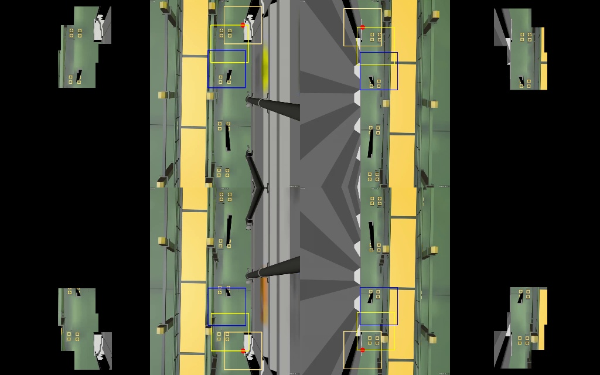

# Node description

## 1. Node for cropping the cell guide and the container corner (xian_image_cop_process)
- run: `rosrun xian_image_process xian_image_cop_process`
- description: cropping 12 images with size `256x256x3`
    - tl_container_corner_crop_image, tr_container_corner_crop_image, bl_container_corner_crop_image, br_container_corner_crop_image: `4` container corner cropped images
    - tl_cell_guide_crop_image1, tr_cell_guide_crop_image1, bl_cell_guide_crop_image1, br_cell_guide_crop_image1, tl_cell_guide_crop_image2, tr_cell_guide_crop_image2, bl_cell_guide_crop_image2, br_cell_guide_crop_image2: `12` cell guide cropped images

        

- subscriber: 
    - type: `xian_msg_pkg::xian_spreader_images_msg`
    - name: `xian_aqc_spreader_images`
- publisher: 
    - type: `xian_msg_pkg::xian_crop_image_msg`
    - name: `xian_crop_images`

- parameters  
    - container corner
        - the center of top left (tl) cropped container corner image: `/xian_aqc_dynamic_parameters_server/xian_tl_container_point_x, /xian_aqc_dynamic_parameters_server/xian_tl_container_point_y`
        - the center of top right (tr) cropped container corner image: `/xian_aqc_dynamic_parameters_server/xian_tr_container_point_x, /xian_aqc_dynamic_parameters_server/xian_tr_container_point_y`
        - the center of bottom left (bl) cropped container corner image: `/xian_aqc_dynamic_parameters_server/xian_bl_container_point_x, /xian_aqc_dynamic_parameters_server/xian_bl_container_point_y`
        - the center of bottom right (br) cropped container corner image: `/xian_aqc_dynamic_parameters_server/xian_br_container_point_x, /xian_aqc_dynamic_parameters_server/xian_br_container_point_y`

    - cell guide cropped image 1
         - the shift (center of tl_cell_guide_crop_image1) relative to the center of top left (tl) cropped container corner image: `/xian_aqc_dynamic_parameters_server/xian_crop_bais_x_tl_1, /xian_aqc_dynamic_parameters_server/xian_crop_bais_y_tl_1`
         - the shift (center of tr_cell_guide_crop_image1) relative to the center of top right (tr) cropped container corner image: `/xian_aqc_dynamic_parameters_server/xian_crop_bais_x_tr_1, /xian_aqc_dynamic_parameters_server/xian_crop_bais_y_tr_1`
         - the shift (center of bl_cell_guide_crop_image1) relative to the center of bottom left (bl) cropped container corner image: `/xian_aqc_dynamic_parameters_server/xian_crop_bais_x_bl_1, /xian_aqc_dynamic_parameters_server/xian_crop_bais_y_bl_1`
         - the shift (center of br_cell_guide_crop_image1) relative to the center of bottom right (br) cropped container corner image: `/xian_aqc_dynamic_parameters_server/xian_crop_bais_x_br_1, /xian_aqc_dynamic_parameters_server/xian_crop_bais_y_br_1`
         
    - cell guide cropped image 2
         - the shift (center of tl_cell_guide_crop_image2) relative to the center of top left (tl) cropped container corner image: `/xian_aqc_dynamic_parameters_server/xian_crop_bais_x_tl_2, /xian_aqc_dynamic_parameters_server/xian_crop_bais_y_tl_2`
         - the shift (center of tr_cell_guide_crop_image2) relative to the center of top right (tr) cropped container corner image: `/xian_aqc_dynamic_parameters_server/xian_crop_bais_x_tr_2, /xian_aqc_dynamic_parameters_server/xian_crop_bais_y_tr_2`
         - the shift (center of bl_cell_guide_crop_image2) relative to the center of bottom left (bl) cropped container corner image: `/xian_aqc_dynamic_parameters_server/xian_crop_bais_x_bl_2, /xian_aqc_dynamic_parameters_server/xian_crop_bais_y_bl_2`
         - the shift (center of br_cell_guide_crop_image2) relative to the center of bottom right (br) cropped container corner image: `/xian_aqc_dynamic_parameters_server/xian_crop_bais_x_br_2, /xian_aqc_dynamic_parameters_server/xian_crop_bais_y_br_2`