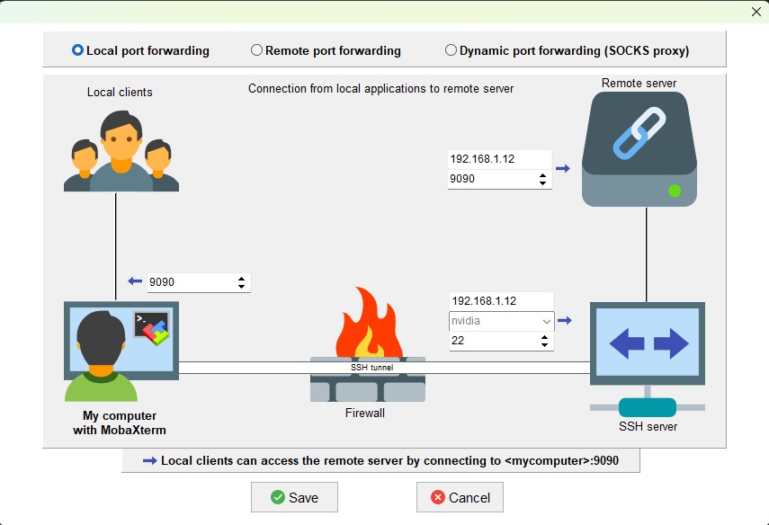

## 1. Retractable box (sender 192.168.1.11:3810)
- Get PLC heart beat
    - `rosparam get /xian_aqc_dynamic_parameters_server/xian_plc_heart_beat`
- PLC error clear
    ```
    rosparam set /xian_aqc_dynamic_parameters_server/xian_plc_error_clear 0
    rosparam set /xian_aqc_dynamic_parameters_server/xian_plc_error_clear 1
    ```

- Retractable box operational mode
    ```
    manual mode
    rosparam set /xian_aqc_dynamic_parameters_server/xian_acds_send_to_retrable_box_mode0 0
    rosparam set /xian_aqc_dynamic_parameters_server/xian_acds_send_to_retrable_box_mode1 0
    rosparam set /xian_aqc_dynamic_parameters_server/xian_acds_send_to_retrable_box_mode2 0
    rosparam set /xian_aqc_dynamic_parameters_server/xian_acds_send_to_retrable_box_mode3 0

    auto mode
    rosparam set /xian_aqc_dynamic_parameters_server/xian_acds_send_to_retrable_box_mode0 1
    rosparam set /xian_aqc_dynamic_parameters_server/xian_acds_send_to_retrable_box_mode1 1
    rosparam set /xian_aqc_dynamic_parameters_server/xian_acds_send_to_retrable_box_mode2 1
    rosparam set /xian_aqc_dynamic_parameters_server/xian_acds_send_to_retrable_box_mode3 1
    ```

- Get retractable box state
    ```
    rosparam get /xian_aqc_dynamic_parameters_server/xian_retrable_box_state0
    rosparam get /xian_aqc_dynamic_parameters_server/xian_retrable_box_state1
    rosparam get /xian_aqc_dynamic_parameters_server/xian_retrable_box_state2
    rosparam get /xian_aqc_dynamic_parameters_server/xian_retrable_box_state3
    ```

- Get ultrasonic state
    ```
    rosparam get /xian_aqc_dynamic_parameters_server/xian_ultrasonic0_0
    rosparam get /xian_aqc_dynamic_parameters_server/xian_ultrasonic1_0
    rosparam get /xian_aqc_dynamic_parameters_server/xian_ultrasonic2_0
    rosparam get /xian_aqc_dynamic_parameters_server/xian_ultrasonic3_0
    rosparam get /xian_aqc_dynamic_parameters_server/xian_ultrasonic0_1
    rosparam get /xian_aqc_dynamic_parameters_server/xian_ultrasonic1_1
    rosparam get /xian_aqc_dynamic_parameters_server/xian_ultrasonic2_1
    rosparam get /xian_aqc_dynamic_parameters_server/xian_ultrasonic3_1
    ```

## 2. Receiver (192.168.1.12 miivii)
- docker
    ```
    sudo docker stop xian_aqc
    sudo docker rm xian_aqc
    xhost +local:root
    sudo docker run --name xian_aqc -itd --log-opt max-size=50m --runtime nvidia --privileged --device /dev/video0 --device /dev/video1 --device /dev/video2 --device /dev/video3 --volume="/tmp/.X11-unix:/tmp/.X11-unix:rw" -v /media/nvidia/nvme0n1pnvme0n1p1/home/nvidia/yangjianbing:/root/code --net host -e NVIDIA_DRIVER_CAPABILITIES=compute,utility --env="DISPLAY" --env="QT_X11_NO_MITSHM=1" --restart=always nvcr.io/nvidia-l4t-jetpack-r35.4.1:v1.7
    
    sudo docker exec -it xian_aqc /bin/bash -c "cd /root && exec /bin/bash"
    ```
- 在power_launch.sh下添加如下内容：
    ```
    #!/bin/sh -e
    chown root:root /run/sshd
    chmod 755 /run/sshd
    service ssh start &
    roslaunch xian_aqc_utils xian_aqc_v2_ubuntu2.launch &
    cd ~/code/xian_aqc_ws/xian_project_file/html/ && python -m http.server 4040 &
    ```

- mobaxterm tunnel
    

- open camera web
    - `http://192.168.1.12:4040/spreader_images.html`

    - if camera image can not show, try start camera show node manually:  
    `rosrun xian_aqc_utils xian_spreader_images_show &`

- Get PLC heart beat
    - `rosparam get /xian_aqc_dynamic_parameters_server/xian_plc_heart_beat`
    
- PLC error clear
    ```
    rosparam set /xian_aqc_dynamic_parameters_server/xian_plc_error_clear 0
    rosparam set /xian_aqc_dynamic_parameters_server/xian_plc_error_clear 1
    ```

- Retractable box operational mode
    ```
    manual mode
    rosparam set /xian_aqc_dynamic_parameters_server/xian_acds_send_to_retrable_box_mode0 0
    rosparam set /xian_aqc_dynamic_parameters_server/xian_acds_send_to_retrable_box_mode1 0
    rosparam set /xian_aqc_dynamic_parameters_server/xian_acds_send_to_retrable_box_mode2 0
    rosparam set /xian_aqc_dynamic_parameters_server/xian_acds_send_to_retrable_box_mode3 0

    auto mode
    rosparam set /xian_aqc_dynamic_parameters_server/xian_acds_send_to_retrable_box_mode0 1
    rosparam set /xian_aqc_dynamic_parameters_server/xian_acds_send_to_retrable_box_mode1 1
    rosparam set /xian_aqc_dynamic_parameters_server/xian_acds_send_to_retrable_box_mode2 1
    rosparam set /xian_aqc_dynamic_parameters_server/xian_acds_send_to_retrable_box_mode3 1
    ```

- Get retractable box state
    ```
    rosparam get /xian_aqc_dynamic_parameters_server/xian_retrable_box_state0
    rosparam get /xian_aqc_dynamic_parameters_server/xian_retrable_box_state1
    rosparam get /xian_aqc_dynamic_parameters_server/xian_retrable_box_state2
    rosparam get /xian_aqc_dynamic_parameters_server/xian_retrable_box_state3
    ```

- Get ultrasonic state
    ```
    rosparam get /xian_aqc_dynamic_parameters_server/xian_ultrasonic0_0
    rosparam get /xian_aqc_dynamic_parameters_server/xian_ultrasonic1_0
    rosparam get /xian_aqc_dynamic_parameters_server/xian_ultrasonic2_0
    rosparam get /xian_aqc_dynamic_parameters_server/xian_ultrasonic3_0
    rosparam get /xian_aqc_dynamic_parameters_server/xian_ultrasonic0_1
    rosparam get /xian_aqc_dynamic_parameters_server/xian_ultrasonic1_1
    rosparam get /xian_aqc_dynamic_parameters_server/xian_ultrasonic2_1
    rosparam get /xian_aqc_dynamic_parameters_server/xian_ultrasonic3_1
    ```